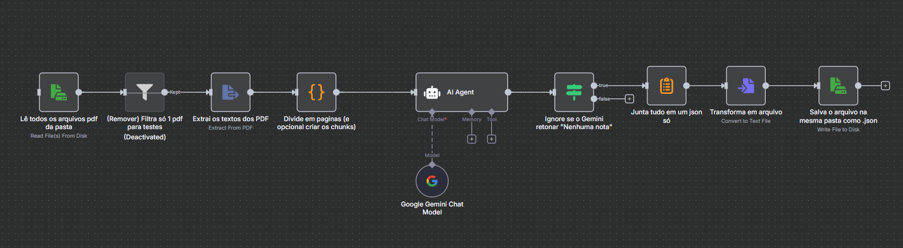

# 📄 Projeto – Extração de Dados de Notas Fiscais com n8n

Este repositório contém um fluxo criado no **n8n** para **automatizar a leitura de PDFs de Notas Fiscais eletrônicas (NF-e)** e **extrair dados estruturados em JSON**.  

O objetivo principal é facilitar a análise de documentos fiscais, automatizando a coleta de informações relevantes de maneira organizada.

---

## 🚀 Funcionalidades

- Leitura de múltiplos arquivos **PDF** de notas fiscais.
- Extração de:
  - Número da nota fiscal
  - Data de emissão
  - Chave de acesso (44 dígitos)
  - Lista de itens de madeira vendidos em **m³** (com exceções específicas)
- Tratamento de **regras de negócio**, como:
  - Ignorar notas fiscais de transferência interna.
  - Filtrar somente produtos em m³ (com exceção de itens específicos como *Barrote Cumaru e Jatobá*).
  - Ignorar produtos irrelevantes (alizares, esquadrias, deck, etc.).
- Geração de um **JSON padronizado** com todos os dados extraídos.

---

## ▶️ Como Usar

1. Abra seu **n8n** e importe o fluxo (`ExtrairDadosNFs.json`).
2. Configure o caminho da pasta de entrada (onde ficam os PDFs).
3. Execute o fluxo.
4. O resultado será salvo como arquivo `.json` na mesma pasta dos PDFs.

---

## 🖼️ Diagrama do Fluxo

## 📥 Download do Fluxo

Se quiser testar este fluxo diretamente no seu **n8n**, basta baixar o arquivo JSON abaixo e importá-lo:

👉 [Baixar fluxo `ExtrairDadosNFs.json`](./ExtrairDadosNFs.json)

---

## 🔎 Explicação dos Nós

### 1. **Lê todos os arquivos PDF da pasta**
- Lê todos os arquivos PDF em uma pasta definida no computador.
- Permite processar várias notas fiscais em lote.

---

### 2. **(Remover) Filtra só 1 PDF para testes** *(desativado)*
- Nó de filtro criado para testes locais.
- Permitia rodar o fluxo apenas em um PDF de exemplo.

---

### 3. **Extrai os textos dos PDF**
- Extrai o conteúdo de texto de cada arquivo PDF.
- Converte o documento em texto legível para análise posterior.

---

### 4. **Divide em páginas (e opcional criar os chunks)**
- Divide o texto extraído em páginas ou blocos menores (chunks).
- Facilita o processamento pelo modelo de IA.

---

### 5. **AI Agent**
- Responsável por interpretar o texto das notas fiscais usando **IA (Google Gemini + LangChain)**.
- Aplica regras de negócio, como:
  - Ignorar notas de transferência interna.
  - Filtrar apenas itens de madeira vendidos em **m³** (com exceções específicas).
  - Retornar os dados em JSON padronizado.

---

### 6. **Google Gemini Chat Model**
- Conecta o fluxo ao modelo de IA Gemini para análise semântica.
- Fornece inteligência na leitura e interpretação dos PDFs.

---

### 7. **Ignore se o Gemini retornar "Nenhuma nota"**
- Valida a resposta do modelo de IA.
- Caso nenhuma nota relevante seja encontrada, o fluxo ignora o resultado.

---

### 8. **Junta tudo em um JSON só**
- Consolida os resultados extraídos de todas as notas fiscais em um único objeto JSON.

---

### 9. **Transforma em arquivo**
- Converte o JSON consolidado em um arquivo `.json`.

---

### 10. **Salva o arquivo na mesma pasta como .json**
- Salva o arquivo final na mesma pasta dos PDFs originais.
- O arquivo `.json` terá o mesmo nome do PDF correspondente.

---

## ⚠️ Observações Importantes

- Este fluxo foi criado para um **caso de uso específico (extração de madeira em m³)**, mas pode ser adaptado para outros tipos de dados.
- **Nenhum dado real de cliente está neste repositório.**
- Caso queira reutilizar, personalize as regras de negócio no **nó "AI Agent"** (LangChain).

---

## 📌 Possíveis Melhorias Futuras

- Suporte a armazenamento em banco de dados (PostgreSQL, MongoDB, etc.).  
- Criação de API para disponibilizar os dados processados.  
- Dashboard para visualização das informações extraídas.  
- Deploy do fluxo no **n8n Cloud** ou em container **Docker**.

---
